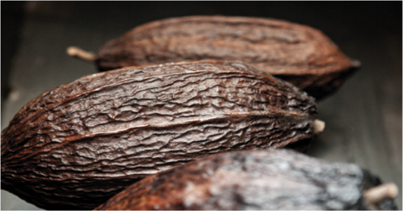
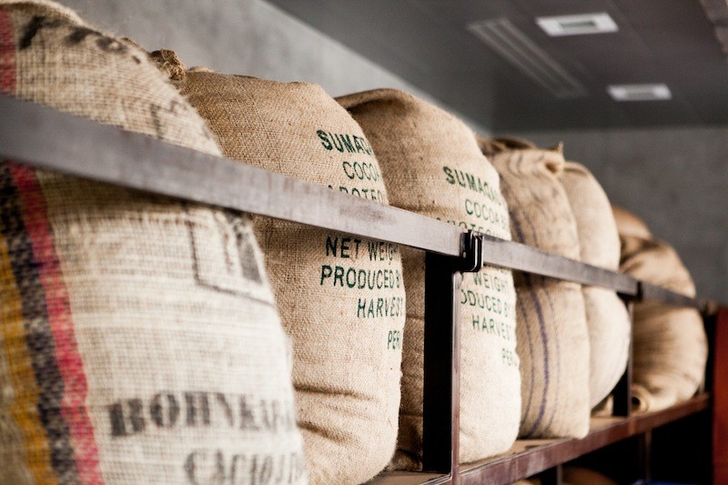
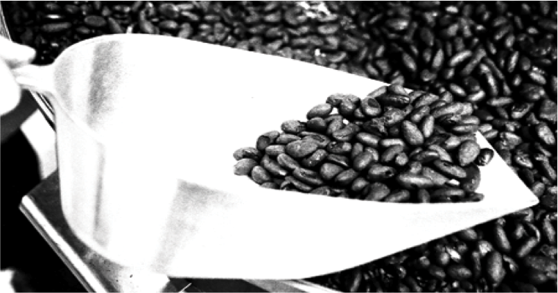
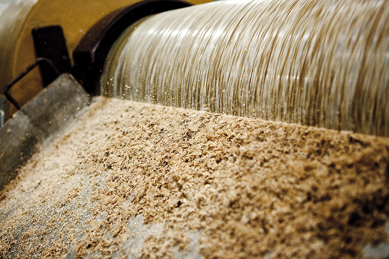
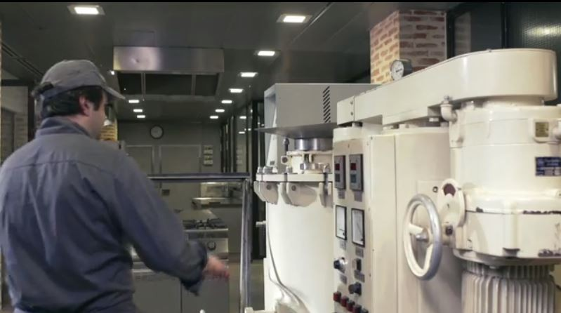
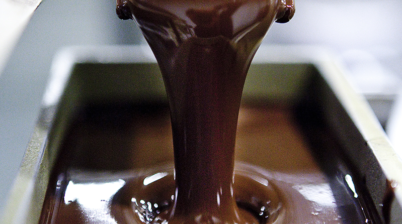

# The Chocolate Factory

The domain this whole demo simulates: four real-shaped chocolate
factories, running an identical production line, making bean-to-bar
chocolate. This file explains the business/process side — for the
data model that represents it, see [`README.md`](README.md#data-model);
for how to deploy and run the simulation, see [`SETUP.md`](SETUP.md).

## The four factories

Region + city codes, ERP-style. All four factories run the identical
six-stage in-factory line (see below) — no specialization — so every
specialist agent reasons over the same schema regardless of factory.

| Code | City | Country / Region |
|---|---|---|
| `EMEA-BCN` | Barcelona | Spain · EMEA |
| `NA-CHI` | Chicago | United States · North America |
| `LATAM-GRU` | São Paulo | Brazil · LATAM |
| `APAC-SIN` | Singapore | Singapore · APAC |

Each factory runs 2–3 production lines, not one: `EMEA-BCN` and
`LATAM-GRU` have 2 lines, `NA-CHI` and `APAC-SIN` have 3 — 10 lines
total (see `simulator/src/seed_data.py`).

## Bean to bar: nine stages, one phase off-site

Cross-checked against the stage breakdowns published by
[Fauchon](https://www.fauchon.com/en/blogs/news/the-different-stages-of-chocolate-making)
and
[Alain Ducasse](https://www.lechocolat-alainducasse.com/fr/fabrication-chocolat).

**Farm Preparation happens near cocoa origin, not at any of the four
factories.** It's documented here for context but not modelled as a
factory production stage — none of `EMEA-BCN`, `NA-CHI`, `LATAM-GRU`,
or `APAC-SIN` perform these steps; they happen weeks earlier, near
cocoa origin (e.g. Ivory Coast, Ecuador, Ghana). It shows up in the
data model only as the origin of incoming material:
`material.Type = "Cocoa Nibs"` on a `supplier`-sourced lot is the
already-fermented, roasted, and winnowed output of this phase. If a
later iteration wants Farm Preparation represented explicitly (e.g.
for a Supply Chain question like "which origin lots are still
fermenting"), it belongs as its own `origin` dimension feeding
`material`, not as factory production lines.

### Farm Preparation — off-site, near origin, not a factory stage

**1. Harvesting & Fermentation** — pods opened, beans fermented 5–7
days to build flavor and cut bitterness.

*Photo: La Maison du Chocolat Alain Ducasse — [lechocolat-alainducasse.com/fr/fabrication-chocolat](https://www.lechocolat-alainducasse.com/fr/fabrication-chocolat)*

**2. Drying & Roasting** — beans dried to reduce moisture, then
roasted at 120–140°C.

*Photos: La Maison du Chocolat Alain Ducasse — [lechocolat-alainducasse.com/fr/fabrication-chocolat](https://www.lechocolat-alainducasse.com/fr/fabrication-chocolat)*

**3. Winnowing** — cracked and winnowed to remove shell, leaving cocoa
nibs.

### Factory Processing — nib → chocolate mass, at the factory

**4. Grinding** — nibs ground into cocoa liquor: cocoa solids plus
cocoa butter.

*Photo: La Maison du Chocolat Alain Ducasse — [lechocolat-alainducasse.com/fr/fabrication-chocolat](https://www.lechocolat-alainducasse.com/fr/fabrication-chocolat)*

**5. Mixing & Refining** — sugar, milk powder and cocoa butter added,
particle size reduced for smoothness.

**6. Conching** — agitated and heated for hours to days to finish
flavor and remove acidity.

*Photo: La Maison du Chocolat Alain Ducasse — [lechocolat-alainducasse.com/fr/fabrication-chocolat](https://www.lechocolat-alainducasse.com/fr/fabrication-chocolat)*

### Finishing — mass → product, at the factory

**7. Tempering** — heated and cooled to stabilize cocoa-butter
crystals for gloss and snap.

**8. Molding & Cooling** — poured into molds, vibrated to clear air,
cooled to solidify.

*Photo: La Maison du Chocolat Alain Ducasse — [lechocolat-alainducasse.com/fr/fabrication-chocolat](https://www.lechocolat-alainducasse.com/fr/fabrication-chocolat)*

**9. Packaging** — demolded, quality-inspected, packaged for
distribution.

---

Only stages 4–9 exist as `production_stage` rows in the data model
(`Phase`: "Factory Processing" or "Finishing") — see
[`README.md`'s data model section](README.md#data-model) for how that
maps to tables. `production_line` is the physical-line dimension (2–3
per factory); `production_stage` is a shared 6-row catalog every line
steps through per batch.

*Images downloaded and hosted locally in `doc/images/` from the
Alain Ducasse chocolate-making page linked above, so they survive that
page moving or changing; all credit for the photos belongs to
La Maison du Chocolat Alain Ducasse.*
