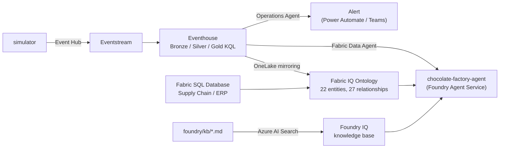
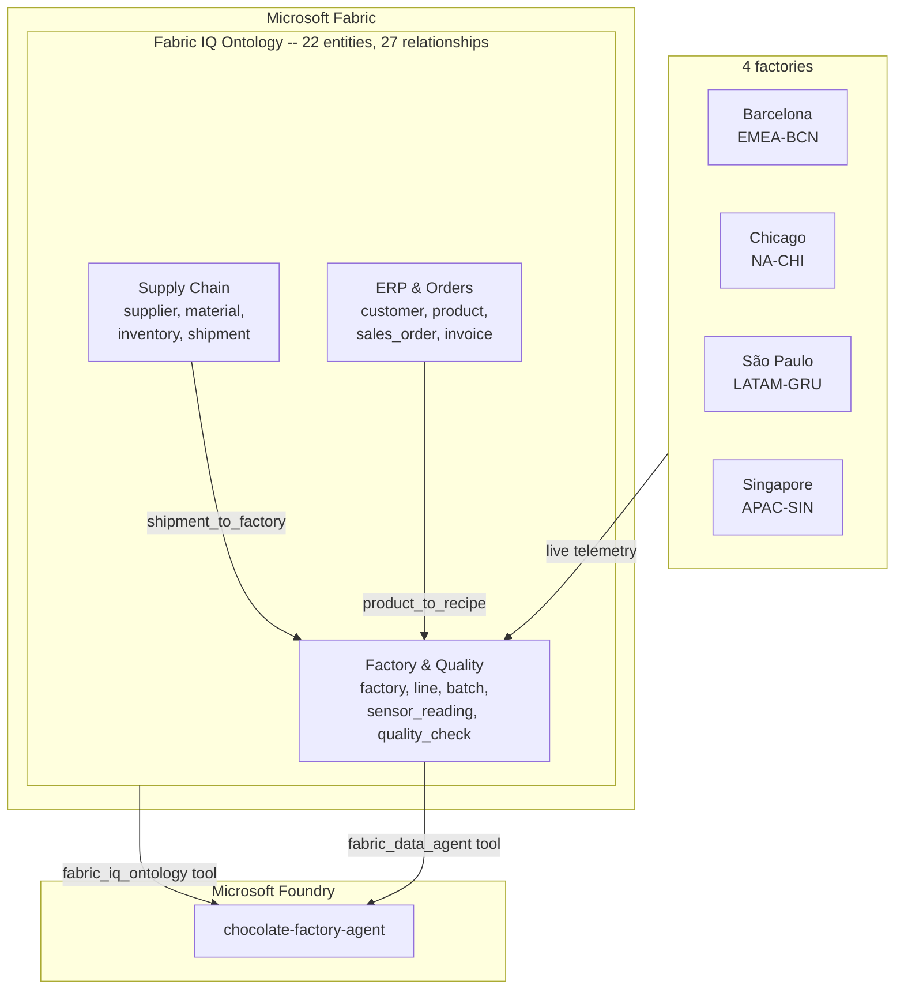

# 🍫 Chocolate Factory — Fabric + Foundry in Action

A live, full-stack demo built for FabCon Europe 2026: four virtual
chocolate factories stream real production telemetry into Microsoft
Fabric, ground a real Fabric IQ Ontology and a Foundry IQ knowledge
base, and get answered live by a single Microsoft Foundry agent that
picks the right tool per question — and cites it.

Nothing here is a mockup. Every box in the diagrams below is real,
deployed infrastructure, provisioned by one `terraform apply`.

**4** factories · **10** production lines · **22** ontology entities ·
**27** bound relationships · **3** agent tools · **1** `terraform apply`

## 🏭 What it is

- **4 factories** (Barcelona, Chicago, São Paulo, Singapore), each with
  2–3 production lines cycling through a 6-stage chocolate-making
  process, streaming live sensor/quality/batch telemetry
- **A full medallion architecture** on Fabric Real-Time Intelligence
  (Eventhouse Bronze → Silver → Gold)
- **A Fabric IQ Ontology** binding that telemetry together with Supply
  Chain/ERP data into one queryable graph — 22 entity types, 27 real
  bound relationships
- **A Foundry IQ knowledge base** grounding policy/definition questions
  a schema alone can't answer
- **One Foundry Agent Service agent**, `chocolate-factory-agent`,
  reasoning across all three live and citing which tool it used —
  including chaining two tools together when a question needs it
- **A Fabric Operations Agent** watching the tempering stage for
  early defect signals

## 🗺️ Architecture

One `terraform apply` provisions every box above.

### Domain model: factories, the ontology, and the Fabric / Foundry split

Supply Chain and ERP only ever connect to Factory & Quality, never to
each other directly — a real gap in the data model, not a diagram
simplification (see "Known limitations" below).

## 📂 Repository map

| Folder | What's there |
|---|---|
| [`INSTRUCTIONS.md`](INSTRUCTIONS.md) | Everything needed to deploy and run this end to end — prerequisites, `terraform apply`, the simulator, and the demo query walkthrough |
| [`simulator/`](simulator) | Python telemetry generator streaming production-line events to Event Hub |
| [`fabric/`](fabric) | The Fabric side: Eventhouse KQL, the Ontology, the SQL Database, the Data Agent, and the Operations Agent |
| [`foundry/`](foundry) | The Foundry side: the agent itself (`foundry/agents/`) and the Foundry IQ knowledge base (`foundry/kb/`) |
| [`infra/`](infra) | One Terraform state provisioning everything above, Azure and Fabric together |
| [`doc/`](doc) | Design memos, the demo script, and the live-verified question bank |

Each subfolder (`fabric/eventhouse/`, `fabric/ontology/`,
`fabric/sql-database/`, `fabric/data-agent/`, `foundry/kb/`,
`foundry/agents/`) has its own README with the detail for that piece.

## ⚡ Quick start

One `terraform apply` provisions the whole stack — Fabric capacity,
workspace, Eventhouse, Ontology, SQL Database, the Foundry IQ
knowledge base, the Foundry project, and the agent itself, wired to
all its tools. Full deploy prerequisites, the simulator (real-time,
backfill, and per-scenario commands), and the query walkthrough are
all in **[`INSTRUCTIONS.md`](INSTRUCTIONS.md)**.

## 🎤 The demo

Short version: the agent picks the right tool per question and cites
it. The exact commands to run it are in
[`INSTRUCTIONS.md`](INSTRUCTIONS.md); the full FabCon talk script —
narrative framing, talking points, and the honest "what didn't make
the cut" section — is in
[`doc/fabcon-demo-scenario.md`](doc/fabcon-demo-scenario.md); the
complete, live-verified question bank is in
[`doc/questions.md`](doc/questions.md).

- *"What counts as an overdue invoice?"* → the knowledge base, with a
  citation
- *"Are there any anomalies I should be aware of?"* → live telemetry
  via the Fabric Data Agent
- *"Which factories are receiving shipments, and how many quality
  checks failed today at those same factories?"* → the agent chains
  the Ontology and the Data Agent together, one feeding the other

## ✅ Verified, not asserted

Every question in [`doc/questions.md`](doc/questions.md) is tagged by
what actually happened when it was run against the live, deployed
stack — not what should happen in theory:

| | Count | Meaning |
|---|---|---|
| ✅ Verified | 11 | Run live, exact result recorded — safe to use as-is |
| 🧪 Candidate | 8 | Plausible given the real data model, not yet run live |
| ❌ Known to fail | 4 | Run live and failed, with the diagnosed reason |

The "Known limitations" below come from that same discipline — real
failures, kept in the docs instead of quietly dropped.

## ⚠️ Known limitations

Stated plainly, not hidden:

- The Fabric Data Agent only grounds Factory/Quality telemetry — a
  second Lakehouse-backed source for Supply Chain/ERP was tried and
  doesn't work as of this writing (see
  [`fabric/data-agent/README.md`](fabric/data-agent/README.md));
  Supply Chain/ERP grounding comes from the Ontology tool instead.
- No `recipe`/`batch` → `material`/`supplier` relationship exists in
  the Ontology — it can answer "who are our suppliers" but not
  genuine lot-level traceability ("which supplier fed this specific
  batch"). A real data gap, not a config issue: that data was never
  generated on either the simulator or seed-data side.
- The Operations Agent needs one manual portal step after `terraform
  apply` to connect its alert action — see
  [`doc/operations-agent-setup.md`](doc/operations-agent-setup.md).
- Two things stay outside Terraform's reach on a fresh deploy: Fabric
  IQ's region availability, and Fabric workspace access for anyone who
  isn't the person who ran `terraform apply` — see
  [`infra/README.md`](infra/README.md).

## 📜 License

MIT — see [`LICENSE`](LICENSE).
